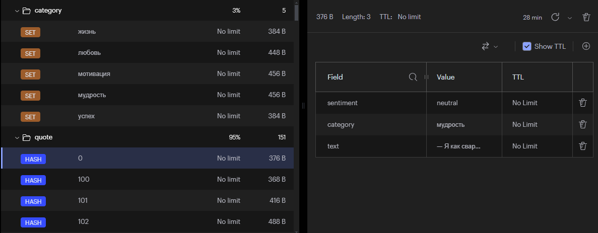

## Проект по созданию сайта с цитатами Джейсона Стетхема

В данном проекте мы создаем сайт с !ненастоящими! "цитатами" Стетхема.  
Материалы взяты с сайта statham.fun с помощью краулера.

Автоматически размечается категория (с помощью TF-IDF) и настроение (nltk.sentiment.SentimentIntensityAnalyzer) цитаты для демонстрирования возможностей субд. Для реальных тегов стоит использовать более точные методы.

UPD. Получились очень несбалансированные группы, поэтому для наглядности я решил просто случайным образом разбить их на категории и тональность

Для проекта используется СУБД redis.

### Запуск проекта

Запуск Docker-контейнера 
```
docker start redisproject-redis-1
```

Установка зависимостей
```
pip install -r requirements.txt
```

Запуск файла скачивания цитат с сайта statham.fun (при необходимости заново загрузить бд)
```
python load_quotes.py
```

Запуск приложения
```
python main.py
```
### СУБД
Наш код взаимодействует с redis, забирает оттуда данные по кнопкам категорий. Также при начальной странице выдается 10 случайных цитат. По кнопке "случайный выбор" выдается случайная цитата.

Цитаты хранятся в Redis в виде хешей, где каждый хеш представляет собой одну цитату. Каждая цитата идентифицируется уникальным ключом вида quote:{id}, где {id} — уникальный идентификатор цитаты.

```
redis_client.hset(f"quote:{i}", mapping={
    "text": quote,
    "category": category,
    "sentiment": sentiment
})
```

quote:{i} — это ключ, представляющий цитату.

Для каждой цитаты мы создаем хеш с полями:

- text — текст цитаты.

- category — категория цитаты (например, "любовь", "мудрость", и т.д.).

- sentiment — настроение цитаты (например, "positive", "negative", "neutral").

Для категорий и тональности создаем сеты, для того чтобы сразу брать готовый набор ключей.
БД выглядит так:


### Web-приложение
Для реализации веб-приложения используется Flask, находится в файле [main.py](main.py).

Фронт реализован на html с некоторыми дополнительными скриптами на css и java в файле [index.html](templates/index.html).
